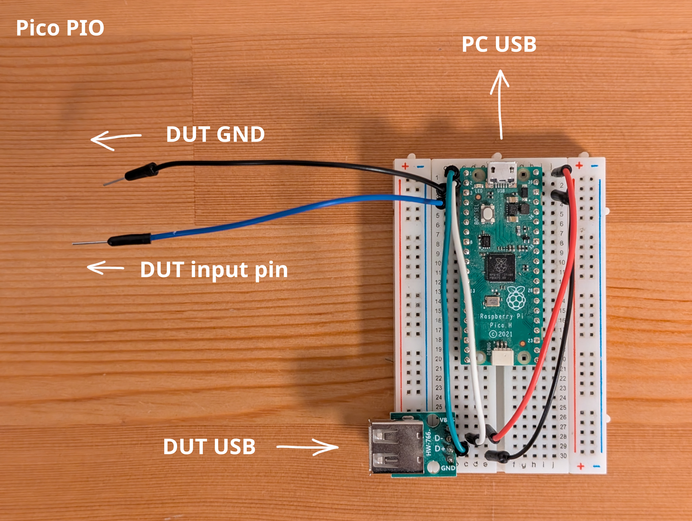
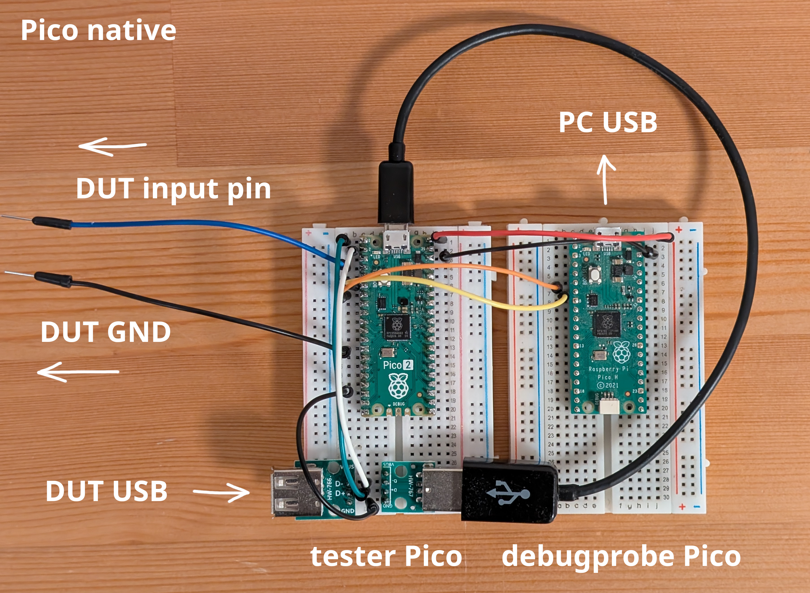

# Latency tester

This is a latency tester for USB input devices. It primarily focuses on game controllers, but should also work for mice and some keyboards.

It runs on boards with RP2040 and RP2350 chips. Currently we have [builds](https://github.com/jfedor2/latency-tester/releases/latest) for the Raspberry Pi Pico, Pico 2, [Adafruit Feather RP2040 with USB host](https://www.adafruit.com/product/5723) and the [RP2040 Advanced Breakout Board - Passthrough Edition](https://github.com/OpenStickCommunity/Hardware/tree/main/Boards/GP2040-CE%20Official%20Boards/RP2040%20Advanced%20Breakout%20Board/RP2040%20Advanced%20Breakout%20Board%20-%20Passthrough).

It measures the time between the input (button press) and the corresponding report sent over USB. It is a self-contained device, it does not test your operating system's input stack, or your monitor's lag. The PC is only used to gather test results, it is not part of the test itself.

The PIO subsystem of the RP2040/RP2350 chip is used for both precise timing of the GPIO pin toggle that simulates the button press and for measuring the time between that button press and the events happening on the USB bus: start-of-frame, IN and DATA packets.

There are two variants of the firmware. One uses the built-in native USB port of the RP2040/RP2350 chip as the host into which the device under test is plugged in. The other uses the [Pico-PIO-USB](https://github.com/sekigon-gonnoc/Pico-PIO-USB) library to create a second USB port.

Both variants use a serial connection to a PC to report the results of the test. On the PIO variant, the native USB port is used for a virtual serial port so you just plug that into your PC directly. On the native variant, a UART serial port is used so you need another piece of hardware to connect that to your PC. You can use any UART-to-USB bridge, including a Pico board running the [debugprobe](https://github.com/raspberrypi/debugprobe) firmware.

The PIO variant is easier to wire on a Pico and runs on existing boards like the Feather and the RP2040 Advanced Breakout Board. The native variant has more stable USB timing and should be preferred for any serious work.

Regardless of which variant you use, you will need to wire one of the GPIO pins on the tester to a button pin on the device you're testing.

## Flashing the firmware

Download the UF2 file corresponding to the board and variant you want to use from the [latest release](https://github.com/jfedor2/latency-tester/releases/latest).

Hold the BOOTSEL button on your board while connecting it to your PC. A drive named "RPI-RP2" or "RP2350" should appear. Copy the UF2 file to that drive.

## Wiring

<details>
<summary>Pico / Pico 2 PIO</summary>

You will need a female USB Type A port. You can use a USB extension cable cut in half.

Wire the port to your tester Pico as follows and plug the device under test into that port.

| Pico | USB port |
| ---- | -------- |
| VBUS | VBUS |
| GND | GND |
| GPIO0 | D+ |
| GPIO1 | D- |

Wire your tester Pico to the device under test as follows:

| Pico | device under test |
| ---- | ----------------- |
| GPIO2 | button input pin |
| GND | GND |


</details>

<details>
<summary>Pico / Pico 2 native</summary>

You will need a USB OTG cable that you will plug into the USB port on the Pico and the device under test will plug into that, possibly with some additional hardware in between.

You need a way to wire GPIO pins into USB lines between the Pico and the device under test. One possible way to do it on a breadboard is shown on the photo below.

Wire the Pico to the USB lines as follows:

| Pico | USB port |
| ---- | -------- |
| GND | GND |
| GPIO0 | D+ |
| GPIO1 | D- |

Wire your tester Pico to the device under test as follows:

| Pico | device under test |
| ---- | ----------------- |
| GPIO2 | button input pin |
| GND | GND |

Additionally you need a USB-UART bridge to talk to and power the tester Pico. You can use another Pico running the [debugprobe](https://github.com/raspberrypi/debugprobe) firmware or any other bridge with a 5V output.

If you're using a Pico running the debugprobe firmware, wire it as follows.

| tester Pico | debugprobe Pico |
| ---- | ----------------- |
| GPIO4 (TX) | GPIO5 (RX) |
| GPIO5 (RX) | GPIO4 (TX) |
| VBUS | VBUS |
| GND | GND |

If you're using another USB-UART bridge, wire its TX pin to GPIO5 on the tester Pico and its RX pin to GPIO4 on the tester Pico. Also wire 5V from the adapter to VBUS on the tester Pico and GND to GND.


</details>

<details>
<summary>Adafruit Feather RP2040 with USB host</summary>

This board comes with a built-in USB host port. Wire the GPIO15 pin on the Feather (labeled "MO") to a button input pin on the device that you're testing, wire GND on the Feather to a ground on the device under test, and plug that device into the USB host port on the Feather.
</details>

<details>
<summary>RP2040 Advanced Breakout Board Passthrough Edition</summary>

This board comes with a built-in USB host port. Wire the GPIO22 pin on the RP2040ABB (labeled "R3") to a button input pin on the device that you're testing, wire GND on the RP2040ABB to a ground on the device under test, and plug that device into the USB host port on the RP2040ABB.
</details>

## Running the tests

You operate the tester device through a <a href="https://www.jfedor.org/latency-tester/">website</a> that talks to it over the serial port. You will need a browser that supports WebSerial like Google Chrome.

Connect your tester device to your PC (either directly or through another device as described in the relevant section above) and on the website click the "Connect" button. Choose the serial port that corresponds to your device.

Then click "Start". If everything is wired correctly, the test will run for around 2 minutes. After it's done it will show the measured average latency and what percentage of reports arrived in which USB frame relative to the frame in which the button press happened.

The charts show the relation between the time within the USB frame that the button press happened and the resulting response time. Click on the chart to flip between different representations of the data.

You can see past test runs on the list at the bottom and you can export/import data sets in the form of JSON files.

There is no server component here, everything runs in the browser on your computer so if you leave the website, the data will be lost. Export the data to a JSON file if you want to view it later.

If you want to host your own copy of the website you can find the files in the [web](web) folder, however keep in mind that WebSerial won't work if you open the website from local disk (`file:///`). It has to be a real web server and if it's not localhost it has to support HTTPS, otherwise WebSerial won't work.

## Building the firmware
```
git clone https://github.com/jfedor2/latency-tester.git
cd latency-tester
git submodule update --init
mkdir build
cd build
PICO_BOARD=pico cmake ..
make
```

## License

The software in this repository is licensed under the [MIT License](LICENSE).
